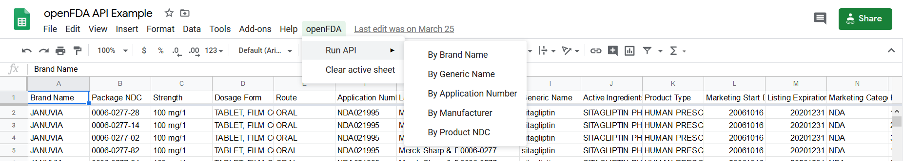
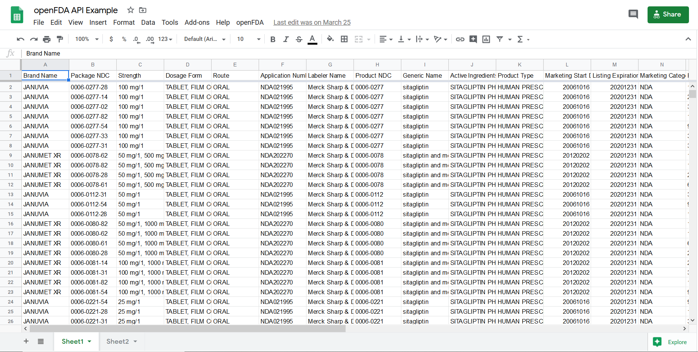

# Google Sheets openFDA API
## Purpose and Features
- Demonstrate [openFDA API](https://open.fda.gov/) applied to Google Sheets.
- Create a replica of the FDA's [NDC Directory](https://www.accessdata.fda.gov/scripts/cder/ndc/index.cfm)
## Compatibility
- Google Apps Script (Javascript)
- Note: I have also translated this repository to VBA for [Microsoft Excel](https://github.com/EszopiCoder/excel-openfda-api)
## Usage
1. In order to use/edit the script for personal use, make a copy of the original [Google Sheet](https://docs.google.com/spreadsheets/d/1ThFer8Cf79UV4E4_Ysz46qA2fzhjE3cJ9xPpOOhukhc/edit?usp=sharing). To make a copy, click 'File' then click 'Make a copy'.
2. When you open the file, a new menu labeled 'openFDA' should appear. Simply run the API by using the 'Run API' submenu.
3. This code runs the API using 1 of 5 parameters (brand name, generic name, application number, manufacturer, or product NDC) and outputs the result to the active sheet.

Note: The parameters do not support partial spelling
## Sample Images

